  

  Fondateur de <a href="https://ganyu.fr">ganyu.fr</a> et <a href="https://karamon.fr">karamon.fr</a>, associé gérant de <a href="https://vskstudio.fr">VSK</a>. 
  Je conçois et maintiens des applications web et desktop, du frontend à l'infrastructure.

  

  

  <strong>Langages</strong> 
  TypeScript · JavaScript · Rust · Python · C# · Java · Lua

  <strong>Frameworks &amp; outils</strong> 
  SvelteKit · Astro · React · Node.js · Express · tRPC · Prisma · Tailwind CSS · Electron · Vite · .NET · Docker · PostgreSQL · Redis

  

  

  

  

  
  
  

  

  

  

  
  

  

  

  
  

  

